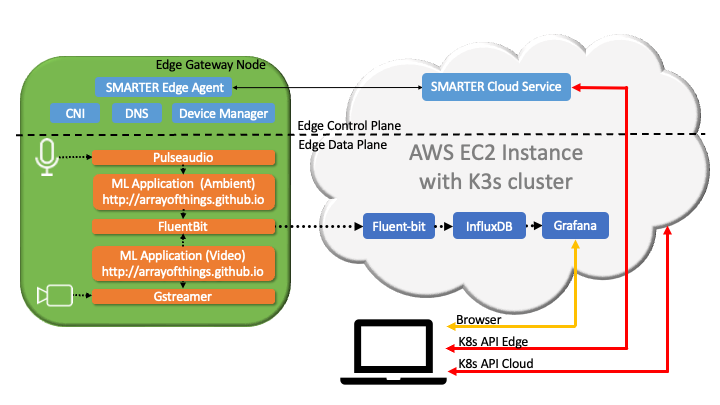

# SMARTER example for LFEdge Catalog

This example demonstrates the use of helm charts and terraform scripts as a deploying mechanism for LFEdge.

Original catalog idea documented [on LFEdge wiki](https://wiki.lfedge.org/display/LE/LF+Edge+Catalog)

## SMARTER application

The example is documented at [getsmarter.io](https://getsmarter.io/). It is an IoT and cloud pplication that uses ML models to process streamed video and audio at the edge aggregating the results in the cloud. 
SMARTER and all of its components are open source. 

This figure shows the components of the application and where they reside. 


### Getting Started with SMARTER

SMARTER has components running in the cloud and at the edge. Video and audio are processed at the edge. Edge control plane and data aggregators and visualizers run in the cloud.
Supported edge nodes are Raspberry PIs (3 or 4 are recommended) running raspian or Ubuntu. Any Arm or x86 linux machine can be supported with minimal changes.

### AWS EC2 installation using terraform script (fully automated installation)

A [terraform](https://www.terraform.io/) [script](https://github.com/smarter-project/documentation/tree/main/terraform/smarter-main.tf) is provided. The script allocates a Graviton EC2 instance at AWS and install SMARTER on it. One or more edge devices can be connected to the SMARTER cloud as edge nodes.

The terraform script assumes that AWS credentials are provided as environment variables [Command line or programmatic access](https://aws.amazon.com/blogs/security/aws-single-sign-on-now-enables-command-line-interface-access-for-aws-accounts-using-corporate-credentials/), so it is assumed that the user has a valid AWS account that is configured so an EC2 instance can be alllocated (Networking configuration, etc.).

```bash
git clone https://github.com/smarter-project/documentation.git
cd documentation/terraform
```

A single parameter is required, a valid email that will be used for [Let's encrypt](https://letsencrypt.org/) to generate certificates for TLS. Substitute xxxx@yyy.com for a valid email.
The following command tests access and verify which objects needs to be created/modified without creating the objects.

```bash
terraform plan -var "letsencrypt_email=xxxx@yyy.com"
```

This command (apply) creates the objects if they do not exist (allocates an EC2 instance, etc.) and prepares them accordingly.

```bash
terraform apply -var "letsencrypt_email=xxxx@yyy.com"
```
This command (destroy) removes any objects that terraform has created and it is managing.

```bash
terraform destroy
```

A more extensive [README](https://github.com/smarter-project/documentation/tree/main/terraform/README.md) is provided.

Terraform executes the following steps:

1. A random password is generated that will be used for Grafana admin access and web access to edge installation scripts and it will be printed at end of the terraform script.
1. An EC2 instance is created and it is allocated an external IPv4 address and the public ipv4 DNS of the instance is printed at end of the terraform script.
1. The instance executes a cloud-init script provided by terraform. The cloud-init script executes in order:
   1. Install K3s cluster (k3s server and k3s agent) 
   1. Install helm application 
   1. Install helm chart for [smarter-cloud](https://github.com/smarter-project/documentation/tree/main/charts/smarter-cloud). This chart installs charts for: cert-manager (provider of certificates), influxdb (data series database), kube-prometheus-stack {Prometheus and Grafana) and fluent-bit (data ingestor).
   1. Install helm chart for [smarter-k3s-edge](https://github.com/smarter-project/documentation/tree/main/charts/smarter-k3s-edge). This chart install a K3s server inside the existing k3s cluster that will be the control plane for the edge nodes. 
   1. Install helm chart for [smarter-edge](https://github.com/smarter-project/documentation/tree/main/charts/smarter-edge) on the smarter-k3s-edge (k3s server running inside the k3s cluster). This chart installs: CNI, DNS, smarter-device-manager.
   1. Install helm chart for [smarter-demo](https://github.com/smarter-project/documentation/tree/main/charts/demo) on the smarter-k3s-edge (k3s server running inside the k3s cluster). This chart installs: [fluent-bit](https://github.com/smarter-project/documentation/tree/main/charts/smarter-fluent-bit), [smarter-gstreamer](https://smarter-project.github.io/gstreamer), [smarter-pulseaudio](https://smarter-project.github.io/pulseaudio), [smarter-image-detector](https://smarter-project.github.io/image-detector), [smarter-audio-client](https://smarter-project.github.io/audio-client) and [smarter-inference](https://smarter-project.github.io/smarter-inference).

Please observe that the full installation of k3s, helm charts in the EC2 instance can take up to 15min (expected around 10min) with various parts of the system being available at different times. If it is desired to follow the installation the command below will print the current log and follow it

```bash
ssh -i ssh/<deployment-name>-prod-k3s.pem ubuntu@<EC2 instance allocated> "tail -f /var/log/cloud-init-output.log"
```

The following endpoints are available at the end of installation:

* Grafana: https://grafana-\<EC2 IP address separated by -\>.nip.io 
* K3s edge kube.config: https://k3s-\<EC2 IP address separated by -\>.nip.io/k3s.yaml.\<random password generated by terraform\>
* K3s edge installation script (k3s-start.sh): https://k3s-\<EC2 IP address separated by -\>.nip.io/k3s-start.sh.\<random password generated by terraform\>
* k3s server endpoint: https://k3s-\<EC2 IP address separated by -\>.nip.io:6444
* Influxdb endpoint: https://grafana-\<EC2 IP address separated by -\>.nip.io:30224

An edge node can be installed by executing the following command at the node:

```bash
wget https://k3s-\<EC2 IP address separated by -\>.nip.io/k3s-start.sh.\<random password generated by terraform\> | bash -
```

The node will connect automatically to smarter-k3s-edge and will download the smarter-demo and start executing it. 

EC2 instance can be accessed by ssh using the generated ssh key (on the ssh directory created by the terraform script). 

### Helm charts

All SMARTER helm charts are referenced by [ArtifactHUB](https://artifacthub.io/) under [SMARTER publisher](https://artifacthub.io/packages/search?org=smarter).

They can be installed into a cluster using helm install like the example below with variables set by the "--set" command.

```bash
helm install smarter/smarter-cloud
```

Helm charts are versioned and upgradeable. 
